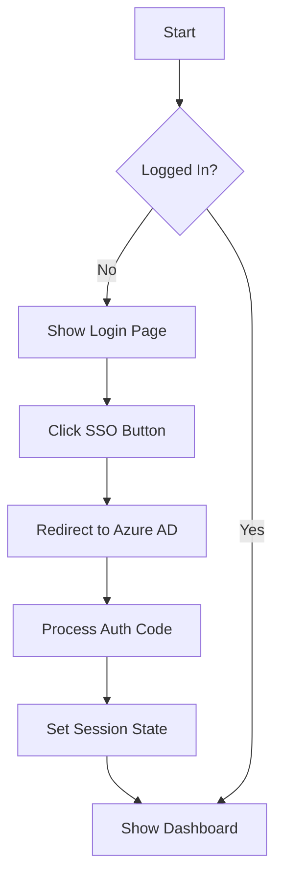

# SCM Scorecard Self-Service Tool

A Streamlit-based analytical tool that enables users to generate and share SCM scorecards by categorizing customers/channels into SCM quadrants based on user input KPI weightages and quartile combinations.

## 🚀 Features

- Azure AD Single Sign-On (SSO) Authentication
- Interactive Dashboard with Sidebar Navigation
- Market Selection and Management
- SCM Scorecard Generation
- Data Management and Analysis

## 🏗️ Project Structure

```
├── app.py                 # Main application entry point
├── components/           # UI Components
│   ├── dashboard.py      # Dashboard view
│   ├── header.py         # Application header
│   ├── login.py          # SSO login interface
│   └── sidebar.py        # Navigation sidebar
├── utils/               # Utility functions
│   ├── auth.py          # Authentication handling
│   ├── session.py       # Session state management
│   └── styles.py        # CSS loader
├── styles/              # Styling
│   └── main.css         # Global CSS styles
└── requirements.txt     # Python dependencies
```

## 🔧 Setup

1. Install dependencies:
```bash
pip install -r requirements.txt
```

2. Configure Azure AD:
   - Set up the following environment variables in `.env`:
     ```
     AZURE_CLIENT_ID=your_client_id
     AZURE_TENANT_ID=your_tenant_id
     REDIRECT_PATH=your_redirect_url
     ```

3. Run the application:
```bash
streamlit run app.py
```

## 🔄 Code Flow

### 1. Application Initialization
- `app.py` serves as the entry point
- Configures Streamlit page settings
- Initializes session state and authentication
- Loads global CSS styles

### 2. Authentication Flow


### 3. Component Structure

#### Login Component (`components/login.py`)
- Renders MARS logo and branding
- Handles SSO button interaction
- Manages authentication redirect

#### Dashboard Component (`components/dashboard.py`)
- Welcome section
- Data management card
- Action cards for various features
- Footer navigation

#### Sidebar Component (`components/sidebar.py`)
- Market selection dropdown
- Navigation menu with icons
- Dynamic page routing

### 4. Session State Management
```python
session_state = {
    'logged_in': bool,      # Authentication status
    'user': dict,           # User information
    'current_page': str     # Current active page
}
```

### 5. Styling
- Global CSS in `styles/main.css`
- Consistent color scheme:
  - Primary: #0000A0 (Deep Blue)
  - Accent: #EC6D2D (Orange)
  - Background: White
- Responsive design with flexbox and grid layouts

## 🔒 Security Features

1. Azure AD Integration
   - OAuth 2.0 authorization code flow
   - Public client authentication
   - State parameter validation
   - Secure token handling

2. Session Management
   - Secure session state
   - Authentication state tracking
   - Protected routes

## 🎨 UI/UX Features

1. Responsive Layout
   - Fixed sidebar navigation
   - Centered content area
   - Clean card-based design

2. Interactive Elements
   - Active state indicators
   - Hover effects
   - Clear call-to-action buttons

3. Consistent Branding
   - MARS logo and colors
   - Professional typography
   - Modern, enterprise design

## 🔜 Next Steps

- [ ] Implement data upload functionality
- [ ] Add SCM placement creation
- [ ] Create scorecard generation
- [ ] Add user management
- [ ] Implement data visualization
- [ ] Add market comparison features
- [ ] Enhance data overview analytics