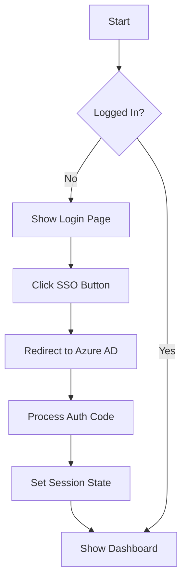

# SCM Scorecard Self-Service Tool

A Streamlit-based analytical tool that enables users to generate and share SCM scorecards by categorizing customers/channels into SCM quadrants based on user input KPI weightages and quartile combinations.

## 🚀 Features

- Single Sign-On (SSO) Authentication with Azure AD
- Interactive Dashboard
- Market Selection and Management
- SCM Scorecard Generation
- Data Management and Analysis

## 🏗️ Project Structure

```
├── app.py                 # Main application entry point
├── components/           # UI Components
│   ├── dashboard.py      # Dashboard view
│   ├── header.py         # Application header
│   ├── login.py          # SSO login interface
│   └── market_modal.py   # Market selection modal
├── utils/               # Utility functions
│   ├── auth.py          # Authentication handling
│   ├── session.py       # Session state management
│   └── styles.py        # CSS loader
├── styles/              # Styling
│   └── main.css         # Global CSS styles
└── requirements.txt     # Python dependencies
```

## 🔧 Setup

1. Install dependencies:
```bash
pip install -r requirements.txt
```

2. Configure Azure AD:
   - Create an Azure AD application
   - Set up the following environment variables in `.env`:
     ```
     AZURE_CLIENT_ID=your_client_id
     AZURE_CLIENT_SECRET=your_client_secret
     AZURE_TENANT_ID=your_tenant_id
     REDIRECT_PATH=/callback
     ```

3. Run the application:
```bash
streamlit run app.py
```

## 🔄 Code Flow

### 1. Application Initialization
- `app.py` serves as the entry point
- Configures Streamlit page settings
- Initializes session state and authentication
- Loads global CSS styles

### 2. Authentication Flow


1. User clicks "Single sign on" button
2. Generates secure state parameter
3. Redirects to Azure AD login
4. Processes authentication callback
5. Validates state parameter
6. Sets user session

### 3. Component Structure

#### Login Component (`components/login.py`)
- Renders MARS logo and branding
- Handles SSO button interaction
- Manages authentication redirect

#### Dashboard Component (`components/dashboard.py`)
- Welcome section
- Data management card
- Action cards for:
  - Data Overview
  - SCM Placements
  - SCM Scorecard
- Footer navigation

#### Market Modal (`components/market_modal.py`)
- Market selection interface
- Create new market functionality
- Market grid display

### 4. Session State Management
```python
session_state = {
    'logged_in': bool,      # Authentication status
    'user': dict,           # User information
    'show_modal': bool,     # Market modal visibility
    'show_create_market': bool  # Create market modal visibility
}
```

### 5. Styling
- Global CSS in `styles/main.css`
- Consistent color scheme:
  - Primary: #0000A0 (Deep Blue)
  - Accent: #EC6D2D (Orange)
  - Background: White
- Responsive design with flexbox and grid layouts

## 🔒 Security Features

1. Azure AD Integration
   - OAuth 2.0 authorization code flow
   - Secure token handling
   - State parameter validation

2. Session Management
   - Secure session state
   - Authentication state tracking
   - Protected routes

## 🎨 UI/UX Features

1. Responsive Layout
   - Centered content
   - Grid-based card system
   - Modal overlays

2. Interactive Elements
   - Hover effects
   - Clear call-to-action buttons
   - Loading states

3. Consistent Branding
   - MARS logo and colors
   - Professional typography
   - Clean, modern design

## 🔜 Next Steps

- [ ] Implement data upload functionality
- [ ] Add SCM placement creation
- [ ] Create scorecard generation
- [ ] Add user management
- [ ] Implement data visualization
